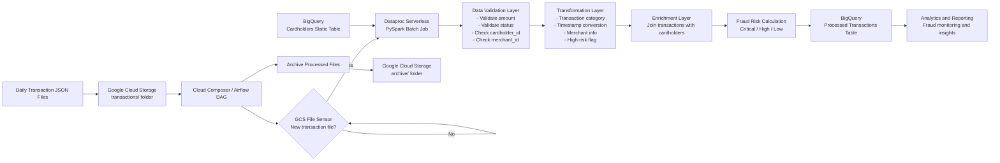
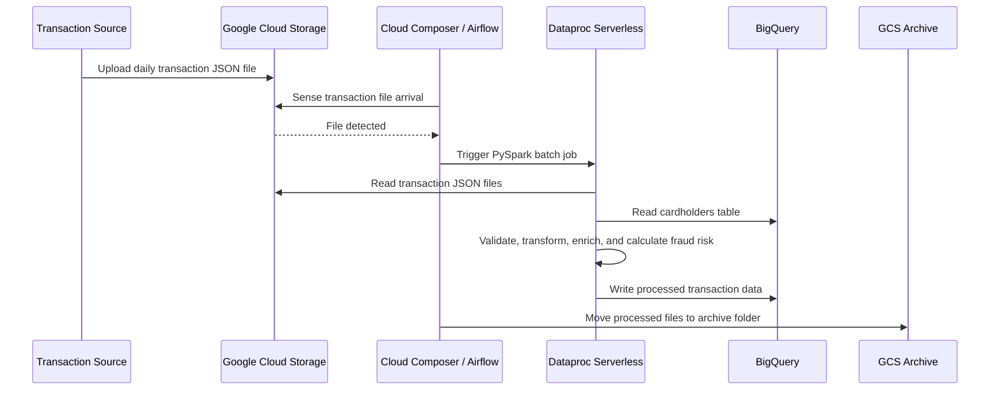
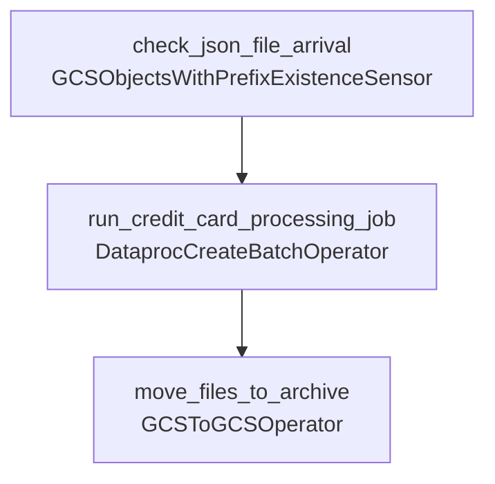

# Credit Card Fraud Risk Analysis Data Pipeline

An end-to-end cloud-based data engineering project for processing daily credit card transactions, enriching them with cardholder information, calculating fraud risk levels, and loading the final processed output into BigQuery for analytics and reporting.

This project simulates an industrial-grade financial data pipeline using **Python, PySpark, Google Cloud Storage, BigQuery, Dataproc Serverless, Cloud Composer / Airflow, PyTest, GitHub, and GitHub Actions CI/CD**.

---

## Project Overview

Credit card transaction systems generate large volumes of daily transactional data. In real-world financial environments, this data must be processed quickly, validated for quality, enriched with customer/cardholder attributes, and analyzed for potential fraud risk.

This project implements a cloud-native data pipeline that performs the following:

- Stores static cardholder information in BigQuery.
- Receives daily transaction JSON files in Google Cloud Storage.
- Uses Airflow to sense the arrival of new transaction files.
- Triggers a PySpark batch job on Dataproc Serverless.
- Reads transaction data from Google Cloud Storage.
- Reads cardholder reference data from BigQuery.
- Performs validation, transformation, enrichment, reward point calculation, and fraud risk classification.
- Writes processed transaction data back into BigQuery.
- Moves processed files into an archive folder after successful completion.
- Includes PyTest-based unit testing for PySpark transformation logic.
- Supports CI/CD deployment through GitHub Actions.

---

## Tech Stack

| Category | Technology |
|---|---|
| Programming Language | Python |
| Distributed Processing | PySpark |
| Cloud Platform | Google Cloud Platform |
| Object Storage | Google Cloud Storage |
| Data Warehouse | BigQuery |
| Serverless Spark Runtime | Dataproc Serverless |
| Workflow Orchestration | Cloud Composer / Apache Airflow |
| Testing Framework | PyTest |
| CI/CD | GitHub Actions |
| Version Control | GitHub |

---

## Diagrammatic Architecture



---

## Sequence Flow



---

## Airflow DAG Task Flow



---

## Repository Structure

```text
credit-card-fraud-risk-data-pipeline/
│
├── data/
│   ├── cardholders.csv
│   ├── transactions_2025-02-01.json
│   ├── transactions_2025-02-02.json
│   └── transactions_2025-02-03.json
│
├── tests/
│   └── test_transactions_processing.py
│
├── .github/
│   └── workflows/
│       └── ci-cd.yml
│
├── airflow_job.py
├── spark_job.py
├── requirements.txt
└── README.md
```

---

## Architecture Components

| Layer | Component | Technology Used | Purpose |
|---|---|---|---|
| Data Source | Daily transaction files | JSON | Raw daily credit card transaction records |
| Storage | Transaction landing zone | Google Cloud Storage | Stores incoming transaction files in the `transactions/` folder |
| Orchestration | Workflow scheduler | Cloud Composer / Apache Airflow | Detects files, triggers Spark processing, and archives processed files |
| File Detection | GCS object sensor | Airflow GCS Sensor | Senses new transaction files in the GCS bucket |
| Processing | Serverless Spark job | Dataproc Serverless + PySpark | Runs data validation, transformation, enrichment, and fraud risk logic |
| Static Reference Data | Cardholders table | BigQuery | Stores cardholder details such as reward points and risk score |
| Data Warehouse | Processed transactions table | BigQuery | Stores final enriched transaction records |
| Archive | Processed file archive | Google Cloud Storage | Moves processed files from `transactions/` to `archive/` |
| Testing | Unit testing | PyTest + Local PySpark | Validates business rules and transformation logic |
| CI/CD | Deployment automation | GitHub Actions | Runs tests and deploys DAG and Spark scripts |

---

## Data Tables

### 1. Cardholders Table

This table stores static cardholder/customer information in BigQuery.

| Column Name | Data Type | Description |
|---|---|---|
| `cardholder_id` | STRING | Unique identifier for each cardholder |
| `customer_name` | STRING | Name of the cardholder |
| `reward_points` | INTEGER | Existing reward points available for the cardholder |
| `risk_score` | FLOAT | Pre-calculated risk score associated with the cardholder |

---

### 2. Raw Transactions JSON Schema

This is the structure of the incoming daily transaction JSON files stored in Google Cloud Storage.

| Column Name | Data Type | Description |
|---|---|---|
| `transaction_id` | STRING | Unique identifier for each transaction |
| `cardholder_id` | STRING | Cardholder ID linked to the cardholder table |
| `merchant_id` | STRING | Unique identifier for the merchant |
| `merchant_name` | STRING | Name of the merchant |
| `merchant_category` | STRING | Merchant business category such as Groceries, Travel, Dining, Healthcare, Shopping, or Electronics |
| `transaction_amount` | FLOAT | Amount spent in the transaction |
| `transaction_currency` | STRING | Currency used for the transaction |
| `transaction_timestamp` | STRING | Original transaction timestamp from the source JSON file |
| `transaction_status` | STRING | Transaction status such as `SUCCESS`, `FAILED`, or `PENDING` |
| `fraud_flag` | BOOLEAN | Source-level fraud indicator |
| `device_type` | STRING | Device used for the transaction, such as Mobile, Web, or POS |
| `merchant_location` | STRING | Merchant location information |

---

### 3. Processed Transactions Table

This table stores the final enriched output in BigQuery after PySpark processing.

| Column Name | Data Type | Description |
|---|---|---|
| `transaction_id` | STRING | Unique identifier for each transaction |
| `cardholder_id` | STRING | Cardholder ID linked to the cardholder record |
| `merchant_id` | STRING | Unique merchant identifier |
| `merchant_name` | STRING | Name of the merchant |
| `merchant_category` | STRING | Merchant category |
| `transaction_amount` | FLOAT | Validated transaction amount |
| `transaction_currency` | STRING | Transaction currency |
| `transaction_timestamp` | TIMESTAMP | Converted transaction timestamp |
| `transaction_status` | STRING | Validated transaction status |
| `fraud_flag` | BOOLEAN | Original fraud indicator from transaction data |
| `device_type` | STRING | Device type used for the transaction |
| `merchant_location` | STRING | Merchant location |
| `transaction_category` | STRING | Amount-based category: Low, Medium, or High |
| `high_risk` | BOOLEAN | Derived flag for high-risk transactions |
| `merchant_info` | STRING | Combined merchant name and merchant location |
| `customer_name` | STRING | Cardholder/customer name from BigQuery |
| `reward_points` | INTEGER | Existing reward points from cardholder table |
| `risk_score` | FLOAT | Cardholder risk score |
| `updated_reward_points` | INTEGER | Updated reward points after transaction amount calculation |
| `fraud_risk_level` | STRING | Final fraud risk classification: Low, High, or Critical |

---

## Data Validation Rules

The PySpark job applies validation rules before transformation.

| Validation Rule | Purpose |
|---|---|
| `transaction_amount >= 0` | Removes invalid negative transaction amounts |
| `transaction_status IN ('SUCCESS', 'FAILED', 'PENDING')` | Ensures only accepted transaction statuses are processed |
| `cardholder_id IS NOT NULL` | Ensures the transaction can be linked to a cardholder |
| `merchant_id IS NOT NULL` | Ensures the transaction has merchant information |

---

## Transaction Category Logic

| Transaction Amount | Transaction Category |
|---|---|
| `<= 100` | Low |
| `> 100 and <= 500` | Medium |
| `> 500` | High |

---

## Fraud Risk Logic

| Risk Output | Condition | Business Meaning |
|---|---|---|
| Critical | `high_risk = True` | Transaction has strong fraud indicators such as fraud flag, very high amount, or high transaction category |
| High | `risk_score > 0.3 OR fraud_flag = True` | Cardholder or transaction has elevated fraud risk |
| Low | No high-risk condition matched | Transaction appears normal based on current business rules |

---

## Reward Points Logic

The pipeline updates reward points based on transaction amount.

```text
updated_reward_points = existing_reward_points + round(transaction_amount / 10)
```

Example:

| Existing Reward Points | Transaction Amount | Updated Reward Points |
|---:|---:|---:|
| 4500 | 120.50 | 4512 |
| 1200 | 9500.75 | 2150 |
| 8000 | 75.20 | 8008 |

---

## PySpark Processing Logic

The core processing logic is implemented in `spark_job.py`.

Main operations:

1. Initialize Spark session.
2. Read static cardholder data from BigQuery.
3. Read daily transaction JSON files from Google Cloud Storage.
4. Apply validation rules.
5. Categorize transaction amount as Low, Medium, or High.
6. Convert transaction timestamp into timestamp format.
7. Create a high-risk transaction flag.
8. Combine merchant name and merchant location into `merchant_info`.
9. Join transaction records with cardholder records using `cardholder_id`.
10. Calculate updated reward points.
11. Calculate fraud risk level.
12. Write final enriched data into BigQuery.

---

## Airflow Orchestration Logic

The orchestration logic is implemented in `airflow_job.py`.

The DAG contains three main tasks:

| Task Name | Operator | Description |
|---|---|---|
| `check_json_file_arrival` | `GCSObjectsWithPrefixExistenceSensor` | Checks whether a transaction JSON file exists in the GCS transactions folder |
| `run_credit_card_processing_job` | `DataprocCreateBatchOperator` | Triggers the PySpark job on Dataproc Serverless |
| `move_files_to_archive` | `GCSToGCSOperator` | Moves processed files from the transactions folder to the archive folder |

Task dependency:

```text
check_json_file_arrival >> run_credit_card_processing_job >> move_files_to_archive
```

---

## Google Cloud Storage Layout

Recommended GCS bucket structure:

```text
gs://<your-bucket-name>/
│
├── transactions/
│   ├── transactions_2025-02-01.json
│   ├── transactions_2025-02-02.json
│   └── transactions_2025-02-03.json
│
├── archive/
│
├── spark_job/
│   └── spark_job.py
│
└── airflow_dag/
    └── airflow_job.py
```

---

## BigQuery Layout

Recommended BigQuery dataset:

```text
credit_card
```

Recommended tables:

| Dataset | Table | Purpose |
|---|---|---|
| `credit_card` | `cardholders` | Static cardholder information |
| `credit_card` | `transactions` | Final processed and enriched transaction data |

---

## Unit Testing

Unit tests are written using PyTest and a local PySpark session.

The test cases validate:

- Transaction category assignment.
- High-risk flag calculation.
- Fraud risk level calculation.
- Cardholder enrichment through joins.
- Reward point update logic.

Run tests locally:

```bash
pytest tests/
```

Run tests with coverage:

```bash
pytest tests/ --cov
```

---

## Installation

### 1. Clone the Repository

```bash
git clone https://github.com/<your-username>/credit-card-fraud-risk-data-pipeline.git
cd credit-card-fraud-risk-data-pipeline
```

### 2. Create a Virtual Environment

```bash
python -m venv venv
```

Activate the environment.

For Windows:

```bash
venv\Scripts\activate
```

For macOS/Linux:

```bash
source venv/bin/activate
```

### 3. Install Dependencies

```bash
pip install -r requirements.txt
```

---

## Requirements

```text
pyspark==3.5.1
pytest
pytest-mock
pytest-cov
```

---

## CI/CD with GitHub Actions

This project supports CI/CD using GitHub Actions.

A typical workflow includes:

1. Checkout repository.
2. Set up Python.
3. Install dependencies.
4. Run PyTest test cases.
5. Authenticate to Google Cloud.
6. Deploy `spark_job.py` to Google Cloud Storage.
7. Deploy `airflow_job.py` to the Cloud Composer DAG bucket.

Example workflow path:

```text
.github/workflows/ci-cd.yml
```

Example workflow:

```yaml
name: CI/CD for Credit Card Fraud Risk Pipeline

on:
  push:
    branches:
      - main
  pull_request:
    branches:
      - main

jobs:
  test-and-validate:
    runs-on: ubuntu-latest

    steps:
      - name: Checkout repository
        uses: actions/checkout@v4

      - name: Set up Python
        uses: actions/setup-python@v5
        with:
          python-version: "3.10"

      - name: Install dependencies
        run: |
          python -m pip install --upgrade pip
          pip install -r requirements.txt

      - name: Run unit tests
        run: |
          pytest tests/ --cov

      # Optional deployment section.
      # Enable after configuring GCP authentication.
      #
      # - name: Authenticate to Google Cloud
      #   uses: google-github-actions/auth@v2
      #   with:
      #     credentials_json: ${{ secrets.GCP_SERVICE_ACCOUNT_KEY }}
      #
      # - name: Set up Google Cloud SDK
      #   uses: google-github-actions/setup-gcloud@v2
      #
      # - name: Deploy PySpark job to GCS
      #   run: |
      #     gsutil cp spark_job.py gs://<your-bucket-name>/spark_job/spark_job.py
      #
      # - name: Deploy Airflow DAG to Composer bucket
      #   run: |
      #     gsutil cp airflow_job.py gs://<your-composer-dag-bucket>/dags/airflow_job.py
```

---

## Security and Configuration Notes

Before making this repository public, replace all hardcoded cloud values with placeholders or environment variables.

Do not expose:

- GCP project IDs from real environments.
- Service account emails.
- Network and subnetwork names.
- Bucket names from private projects.
- Credentials or service account keys.
- Real customer or financial data.

Recommended placeholder format:

```python
BQ_PROJECT_ID = "<your-gcp-project-id>"
BQ_DATASET = "<your-bigquery-dataset>"
gcs_bucket = "<your-gcs-bucket-name>"
```

---

## Business Impact

This project demonstrates how a financial institution can automate transaction processing and fraud risk classification using a scalable cloud-native data engineering pipeline.

Key business benefits:

- Automated daily transaction ingestion.
- Reduced manual data processing effort.
- Scalable PySpark processing using Dataproc Serverless.
- Centralized analytics-ready data in BigQuery.
- Fraud risk classification for suspicious transaction monitoring.
- Automated workflow orchestration using Airflow.
- Improved reliability using unit testing and CI/CD practices.

---

## Future Enhancements

Potential improvements:

- Add currency normalization for multi-currency transactions.
- Add partitioned and clustered BigQuery tables for improved query performance.
- Add Looker Studio dashboards for fraud analytics visualization.
- Add anomaly detection or machine learning models for fraud prediction.
- Add real-time streaming using Pub/Sub and Dataflow.
- Add alerting for Critical fraud risk transactions.
- Add Terraform scripts for automated GCP infrastructure provisioning.
- Add Great Expectations or Deequ for advanced data quality checks.
